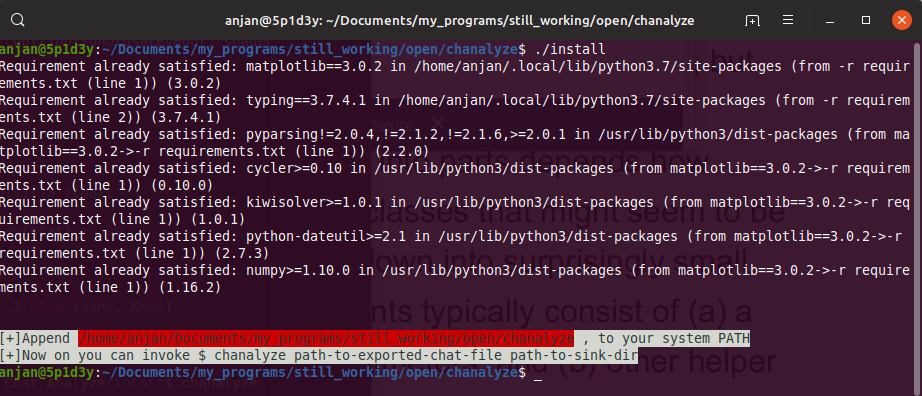

# chanalyze
A simple WhatsApp Chat Analyzer ( for both Private &amp; Group chats ), made with :heart:
## nomenclature
**Chat** _+_ **Analyze** _=_ **chanalyze**
## motivation
- I was interested in learning how much time I'm spending on WhatsApp _or_ in which conversation I'm more or less involved/ attached _or_ at which part of day I'm more involved in Chatting etc.
- So I'm writing these scripts for analyzing **WhatsApp** Chat _( both Private & Group )_, which can easily be exported into a _*.txt_ file from WhatsApp Mobile Application.
- That _*.txt_ is parsed, cleaned & objectified, so that it can be analyzed with ease.
- Using this tool, now I can understand each minute I spent on a certain Chat _( or may be how someone else spent )_ or how many times someone started a conversation _( which might be a good indicator of interest of participant(s) towards Chat )_
- For sake of **Privacy** test data file(s), which were used for plotting following chart(s), are kept private. Also Contact Name(s)/ Number(s) are partially grayed.
## usage
- Clone this repository in a suitable place on your system or just download this ZIP.
```shell
$ git clone https://github.com/itzmeanjan/chanalyze.git
```
- If downloaded ZIP, first unzip it in a suitable place on your system _( may be at `echo $HOME` :wink: )_
- Get into chanalyze _( root directory of this project )_
```shell
$ cd chanalyze
```
- If you list all files/ dirs present under it, you'll find two BASH scripts, named **chanalyze** & **install**
```shell
$ ls # or use `tree`, if you've it
```
- You need to make both of them executable
```shell
$ chmod +x chanalyze install
```
- Make sure you've installed **pip3** via your system package manager
```shell
$ sudo apt-get install python3-pip # for ubuntu
```
```shell
$ sudo dnf install python3-pip # for fedora
```
```shell
$ sudo eopkg install python3-pip # for solus
```
- Time to install dependencies of this project via **pip3**
```shell
$ ./install
```

- Follow the instruction, which you find on screen _( red colored )_
- You need to append _path to this project directory_ to your system `PATH` variable
- If you're using BASH, search for a file, named `.bashrc` in `HOME` directory of your system. Can't find ? --- _Then create a file of same name in your HOME directory_
```shell
$ find ~/ -name '.bashrc'
```
- Add following line at the end of that script _( BASH initialization / setup script )_
```shell
export PATH="$PATH:/path/which/was/requested/to/be/added/in/previous/step"
```
- Now Log Out of system & Log In _( or run following command )_
```shell
$ cd
$ source .bashrc
```
- Open terminal & run
```shell
$ chanalyze
```
- If you find any output similar to following one, then you're done with installation & `PATH` setup
```shell
[+]chanalyze v0.1.1 - A simple WhatsApp Chat Analyzer

	$ chanalyze `path-to-exported-chat-file` `path-to-sink-directory`

[+]Author: Anjan Roy<anjanroy@yandex.com>
[+]Source: https://github.com/itzmeanjan/chanalyze ( MIT Licensed )

[#]Success: 0.0000%
```
- Now analyze your exported WhatsApp chat(s), using **chanalyze**
## chanalysis _( Chat Analysis )_
- [x] [Total Contribution of Chat Participants](docs/totalContribution.md)
- [x] [Hourly Contribution of Chat Participants](docs/hourlyContribution.md)
- [x] [Activity of Chat Participants on every Minute of Day](docs/contributionByMinute.md)
- [x] [Activeness of Chat](docs/chatActiveness.md)
- [x] [Conversation Initializing Chat Participant Identification _( using Mean & Median Delay )_ - Reflecting Participant's interest towards Chat](docs/conversationStartingPerson.md)
- [x] [Top Emojis used in Chat](docs/emojiStat.md)

---

**More to come soon ... :wink:**