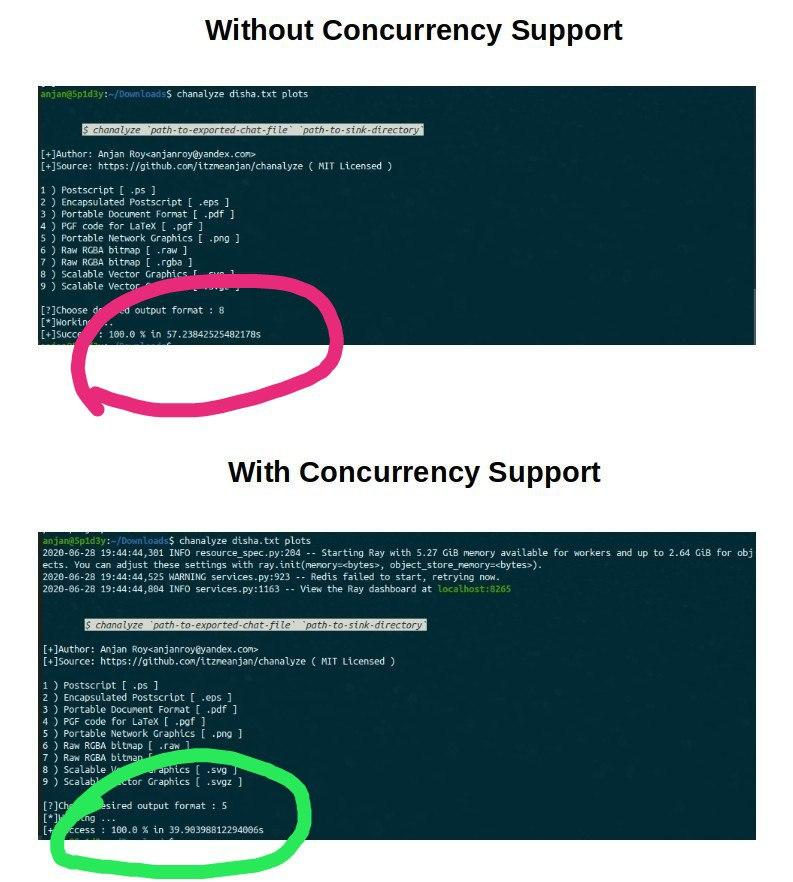

# chanalyze



A simple WhatsApp Chat Analyzer ( for both Private &amp; Group chats ), made with :heart:

**Now with concurrency support !!!**

## nomenclature

**Chat** _+_ **Analyze** _=_ **chanalyze**

## motivation

- I was interested in learning how much time I'm spending on WhatsApp _or_ in which conversation I'm more or less involved/ attached _or_ at which part of day I'm more involved in Chatting etc.
- So I'm writing these scripts for analyzing **WhatsApp** Chat _( both Private & Group )_, which can easily be exported into a _*.txt_ file from WhatsApp Mobile Application.
- That _*.txt_ is parsed, cleaned & objectified, so that it can be analyzed with ease.
- Using this tool, now I can understand each minute I spent on a certain Chat _( or may be how someone else spent )_ or how many times someone started a conversation _( which might be a good indicator of interest of participant(s) towards Chat )_
- For sake of **Privacy** test data file(s), which were used for plotting following chart(s), are kept private. Also Contact Name(s)/ Number(s) are partially grayed.

## usage

- Install `chanalyze` from PyPI

```bash
$ python3 -m pip install --user chanalyze
```
- Make sure you've added `$HOME/.local/bin` to your `$PATH` environment variable
- Now analyze your exported WhatsApp chat(s), using **chanalyze**

## chanalysis _( Chat Analysis )_

- [x] [Total Contribution of Chat Participants](docs/totalContribution.md)
- [x] [Hourly Contribution of Chat Participants](docs/hourlyContribution.md)
- [x] [Activity of Chat Participants on every Minute of Day](docs/contributionByMinute.md)
- [x] [Activeness of Chat](docs/chatActiveness.md)
- [x] [Conversation Initializing Chat Participant Identification _( using Mean & Median Delay )_ - Reflecting Participant's interest towards Chat](docs/conversationStartingPerson.md)
- [x] [Top Emojis used in Chat](docs/emojiStat.md)

