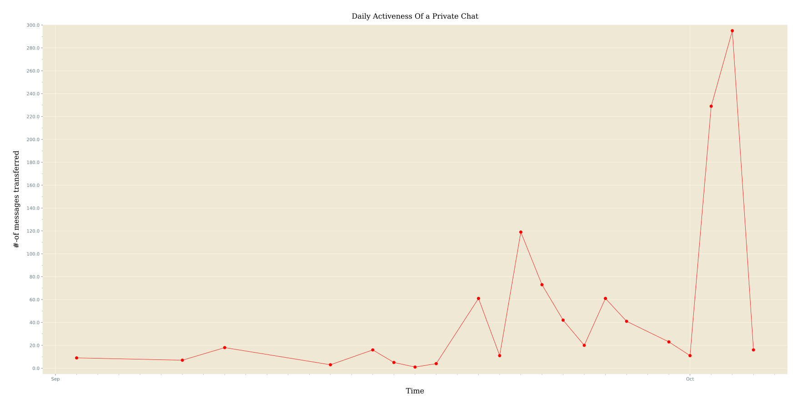
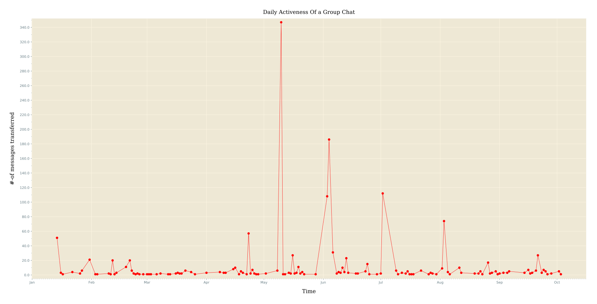

### Activeness of Chat _( by Date )_
Here we'll try to understand how participants of a Chat _( Private or Group )_ were active on each day of Year _( for which we've record )_.

If a chat is very long _( spanning over a period of more than one Year )_, then we'll plot whole data for one year i.e. we'll simply accumulate data into 365 _( or 366 )_ days of one year.

For smaller chats it'll be performing as expected.

Let's take some examples ...

_For Private Chat_

_For Group Chat_

