### Detailed Activity Analysis of Chat Participants _( by minute )_
In previous section, I tried to find out how users are spending their time in Chat(s), which we're analyzing, by splitting the whole day into **8** equal parts.

Time for some detailed investigation ... :wink:

Here I'm going to split whole day into 4 equal parts and draw 4 subplots, where I'll try to depict how a user spent each minute of his/ her day _( 1440 minutes in a day )_ over this period of time _( for which we've Chat record )_, in this Chat.

It'll be helpful in understanding, when this user is generally more or less active _( i.e. activity patterns / sleep patterns )_, depending upon what we're observing for this period of time.

No doubt you've already understood, if you had a very long Private Chat with a person or a high traffic group, consider analyzing that Chat file, you'll be happy to learn much more about those participating peoples.

So I applied `util.plotActivityOfUserByMinute()` on a collection of messages from each Participants of Chat _( both Private & Group )_, and result was really interesting.

Check them out.

#### For Private Chat :
1.

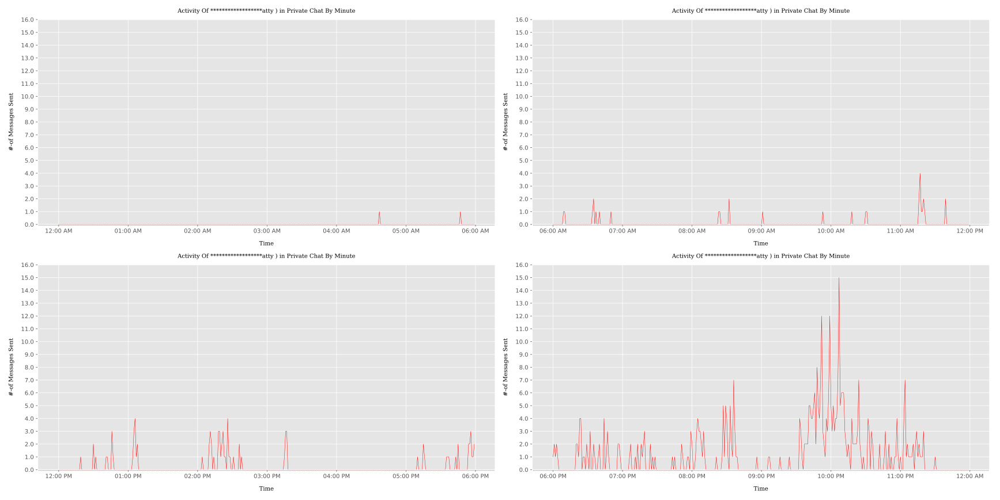
2.

#### For Group Chat :
1.

2.

3.

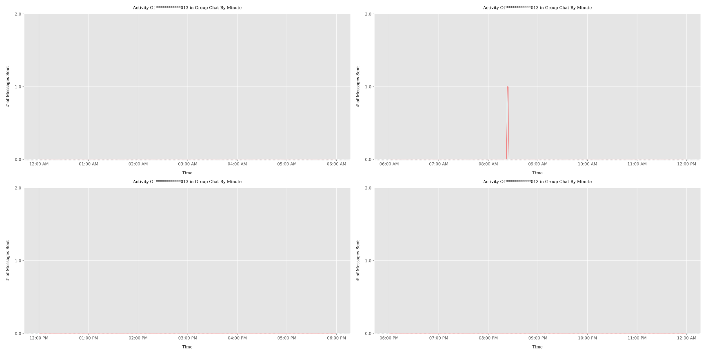

4.

5.

6.

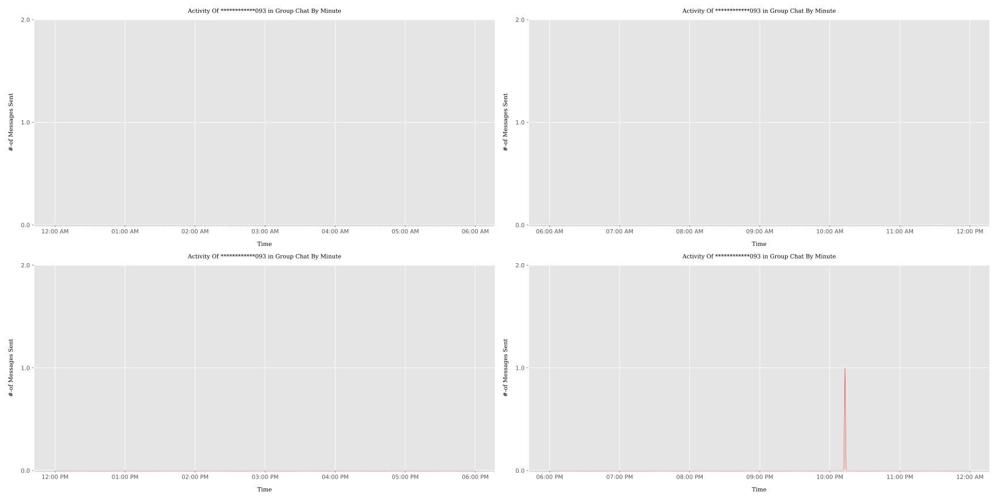

7.

8.

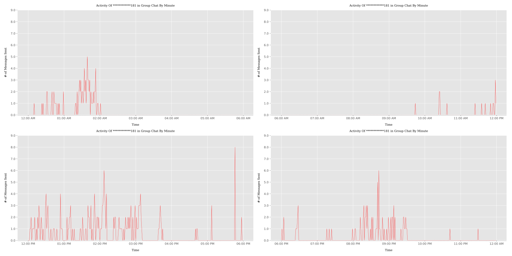

9.

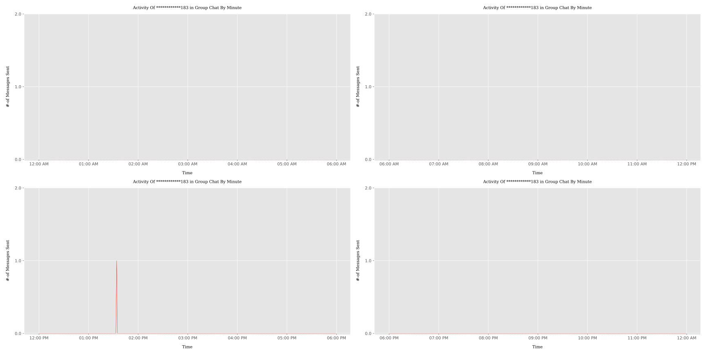

10.

11.

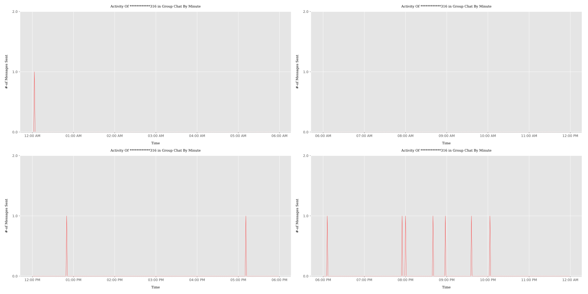

12.

13.

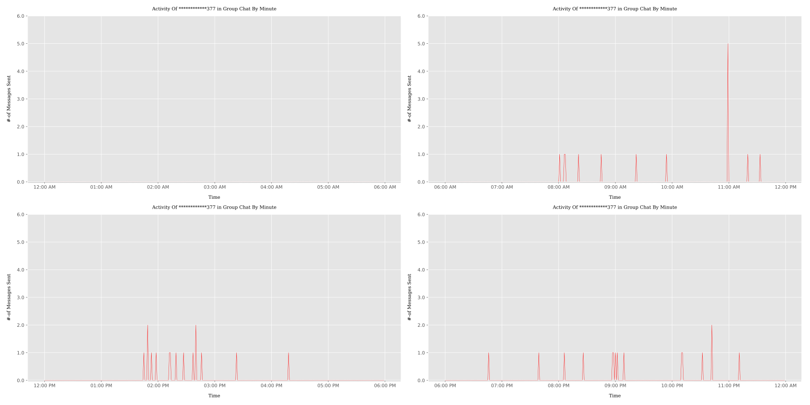

14.

15.

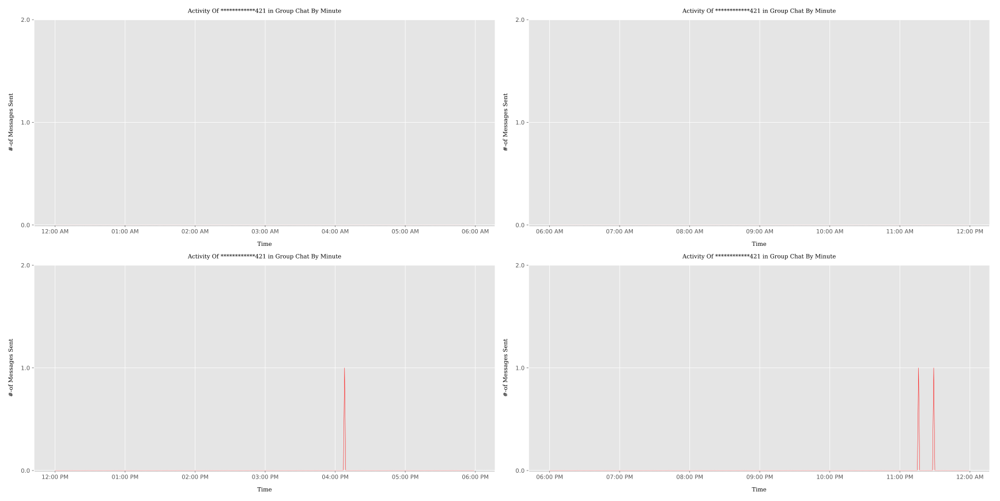

16.

17.

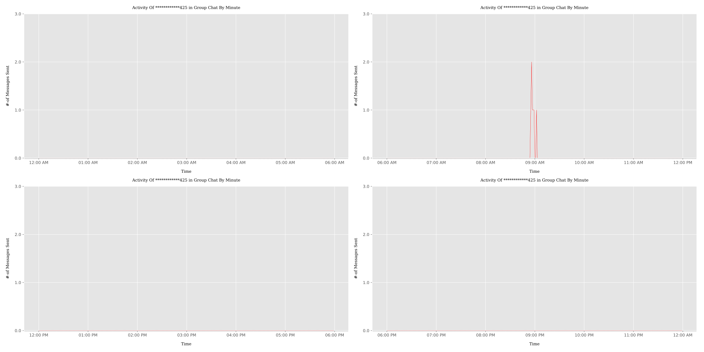

18.

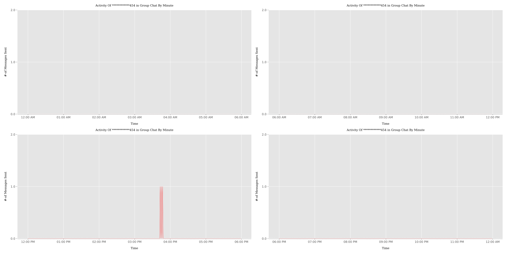

19.

20.

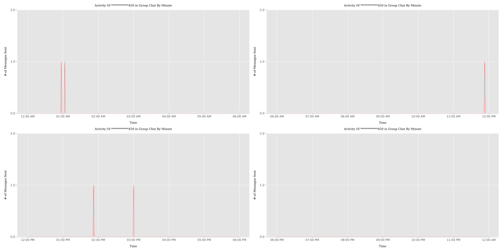

21.

22.

23.

24.

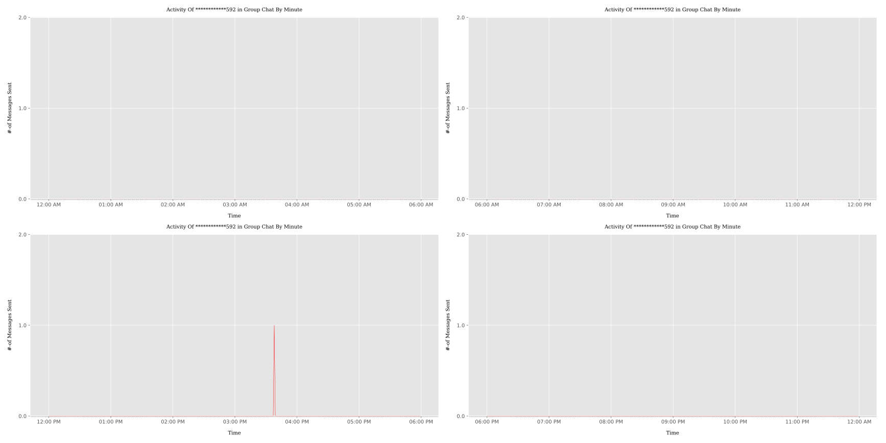

25.

26.

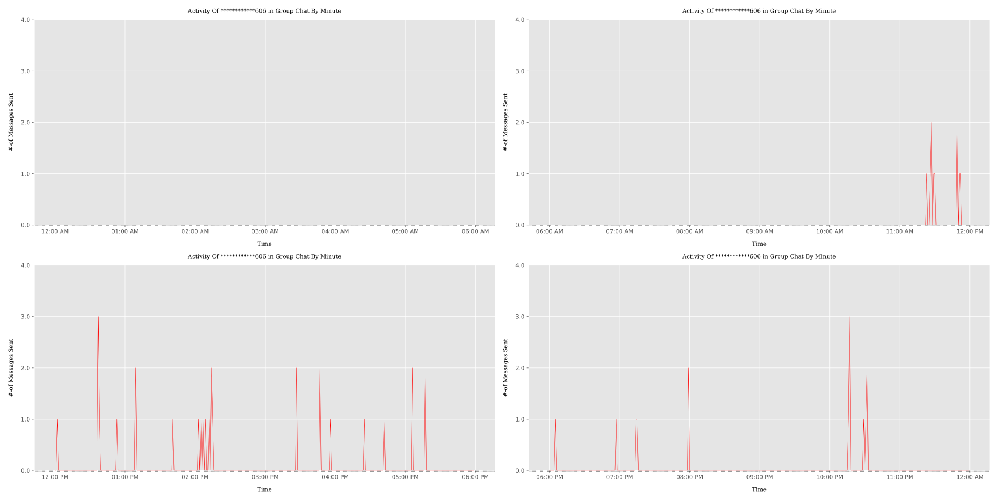

27.

28.

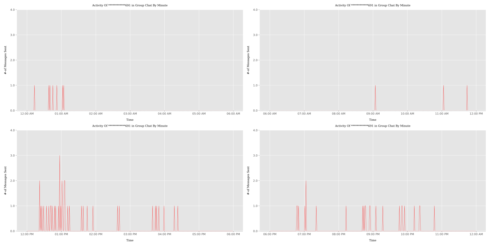

29.

30.

31.

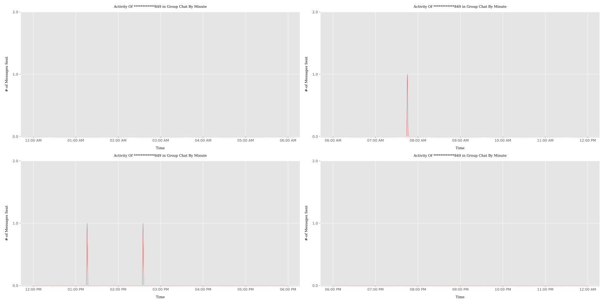

32.

33.

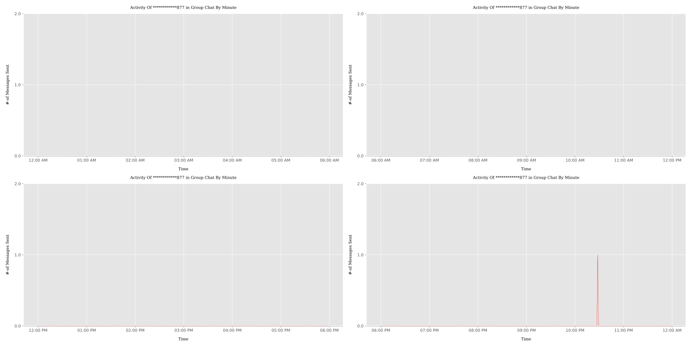

34.

35.

36.

37.

38.

39.

40.

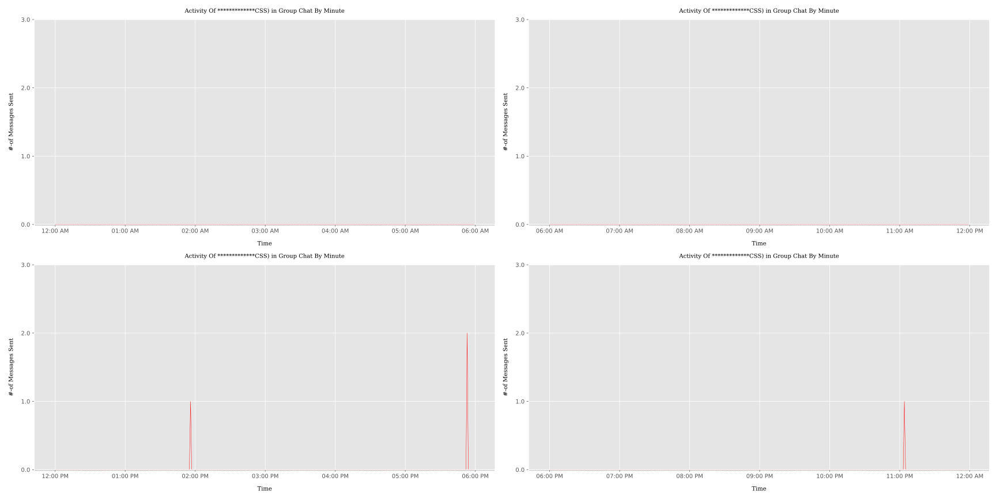

41.

42.

43.

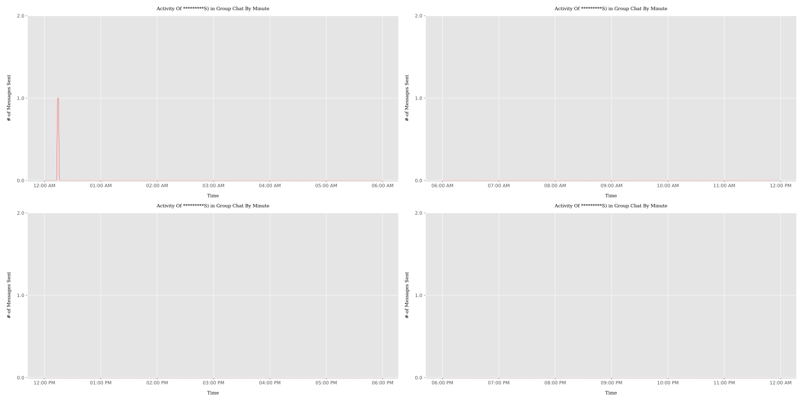

44.

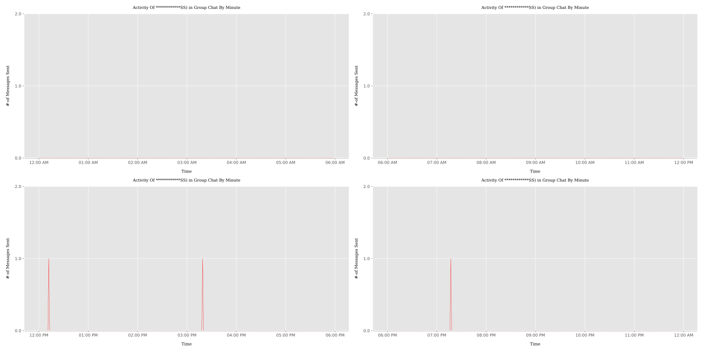

45.

