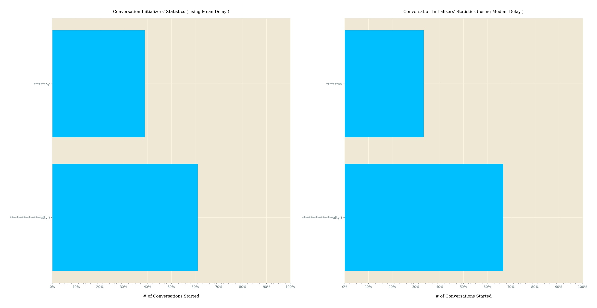
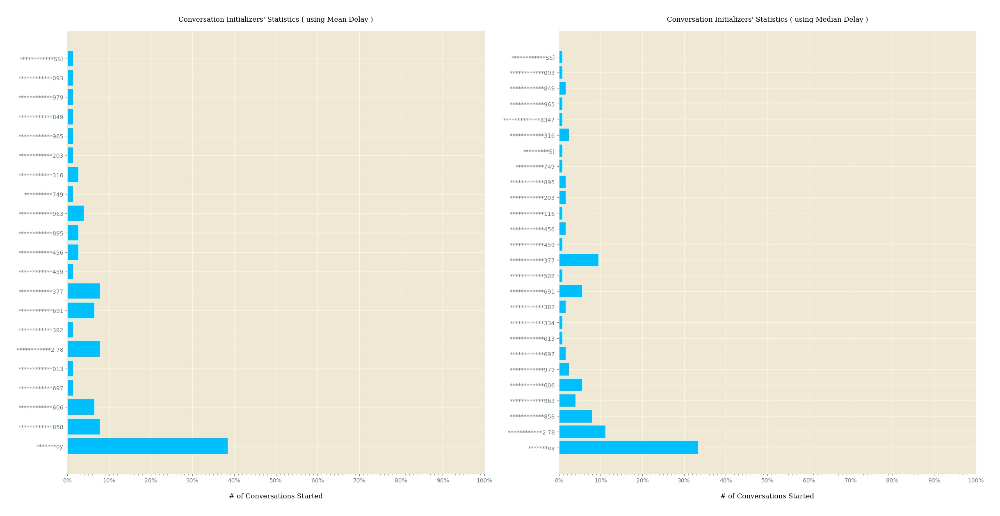

### Conversation Initializing Person ( chat participant ) Identification _( using Mean & Median Delay )_ - Reflecting interest of Participant(s) towards Chat
In a Chat _( may be Private or Group )_, there're multiple conversations, which start and end at different point of day _( may be spanning across multiple days )_, within that whole time period, for which we've Chat record.

Now we need to identify those messages _( using index )_, which were at verge of these conversation(s) i.e. end of one conversation & init of next conversation.

Now if we've that stat, we can simply get time elapsed between those messages on verge.

So what we do, calculate time elapsed between all messages for a Chat i.e.

**# of delays to be calculated = ( # of messages in Chat - 1 )**

Now there'll be multiple time delay values _( well they're in Second )_, which will be same, so we'll find unique values.

Using those unique delay values, we'll compute median _( aah !!!, need to sort them ascendingly first )_ & mean delay.

Those messages, which were sent after some time _>=_ mean delay, from previous message sent by some paricipant of this Chat, are extracted, so that we can find out who sent this message _( using index )_.

Now our job is easy, we've determined which participant started how many conversation(s) over lifetime of this Chat, which can give us an idea about which participant is how much keen in participating in that Chat.

We can perform similar analysis using median delay.

Implementation Time _( on test data )_ ...

For a Private Chat

For one Group Chat

