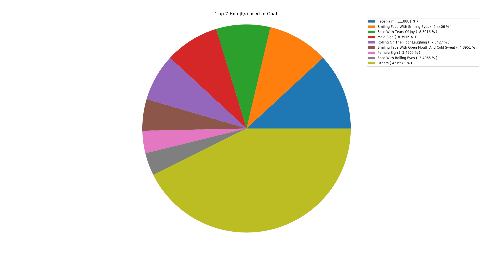
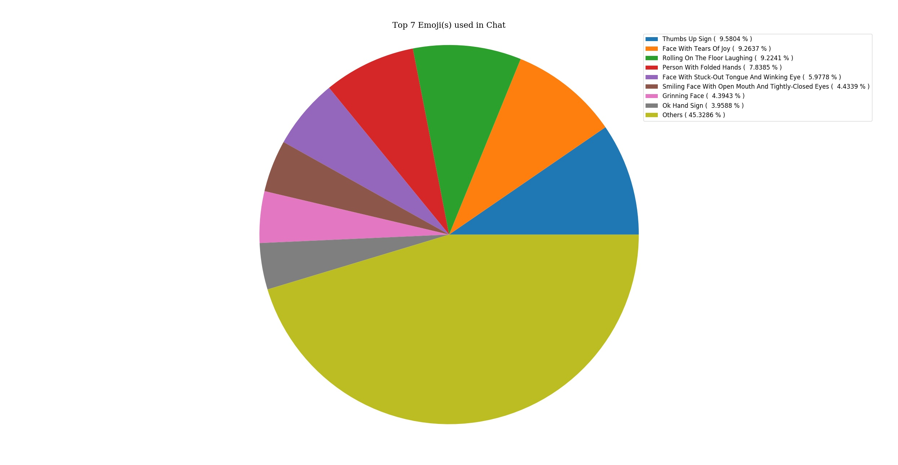

### Top 7 Emojis used in Chat
First I extracted all Non-ASCII characters present in Chat, from which I filtered out only those _Unicode_ characters which are emojis _( as per Unicode v12.0 )_

Now it's pretty easy to determine frequency of usage of these emojis, from which only top 7 emojis were extracted.

**Now there's an issue I faced while plotting a Pie chart of emoji usage, using matplotlib, which doesn't let me properly put emojis into figure, due to absence of emoji supporting Font(s).**

Which is why I plotted Pie Chart with a legend, where equivalent name of emojis were given. :confused:

#### Example:

For a Private Chat

For Group Chat

