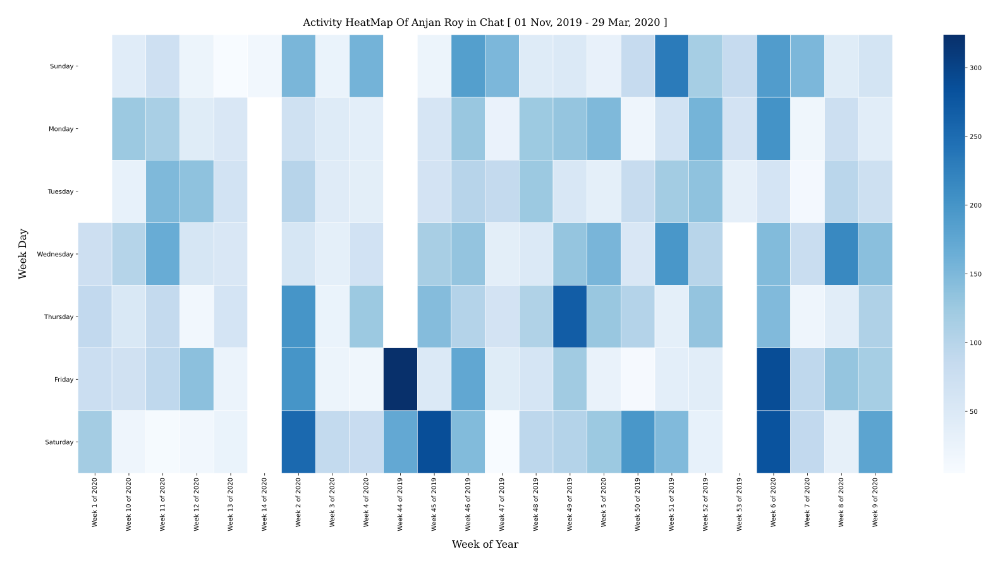

### Chat Activity HeatMap

For each chat participants, `chanalyze` will generate GitHub style activity heatmaps _( though differently colored :wink: )_, depicting user activity across weekdays over chat timeperiod. 

#### Example Plot

