### Contribution of Users in Chat by Hour
I splitted a day into 8 equal parts and extracted statistics of activity ( mine & others too ) for each of those timespans, to learn when users are more active. And no doubt result was interesting _( atleast for Group Chat :wink: )_.

- 00:00:00 - 02:59:59
- 03:00:00 - 05:59:59
- 06:00:00 - 08:59:59
- 09:00:00 - 11:59:59
- 12:00:00 - 14:59:59
- 15:00:00 - 17:59:59
- 18:00:00 - 20:59:59
- 21:00:00 - 23:59:59

Following Pie charts show how two participants contributed to a Private chat i.e. how much active were they at which time period.

ByHour.png)

Following Pie charts showing how participants were contributing in a Group Chat.

ByHour.png)

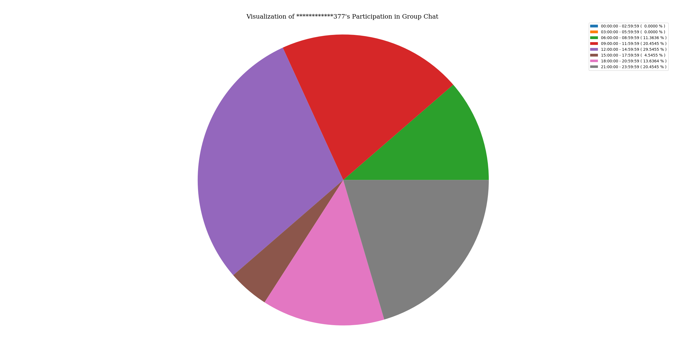

ByHour.png)

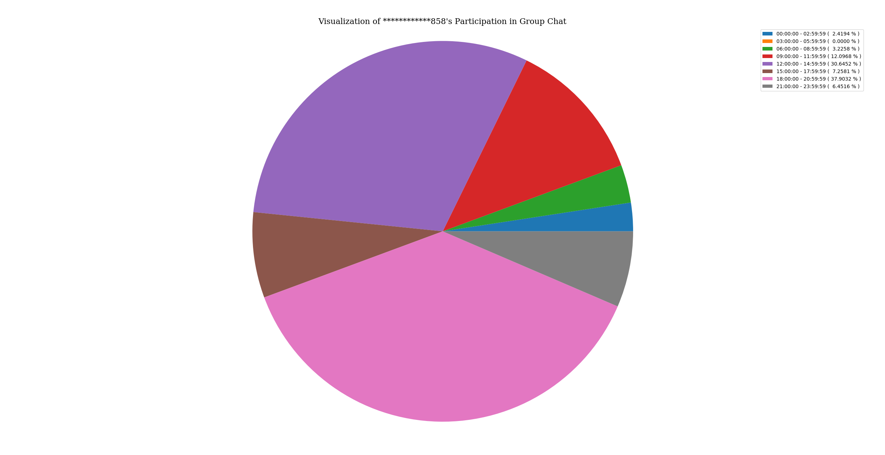
ByHour.png)
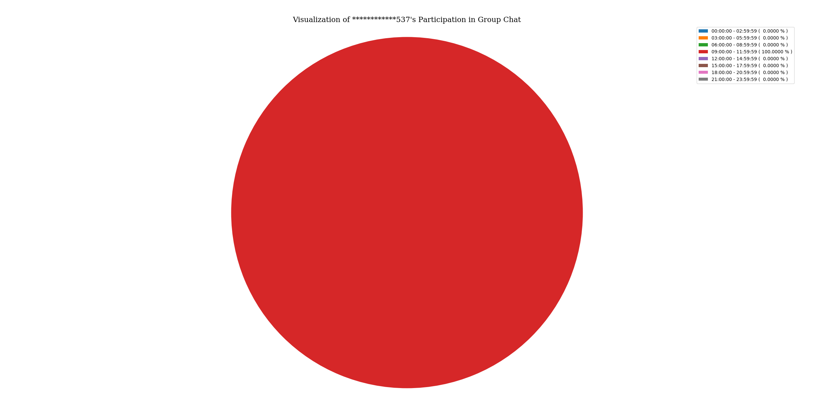
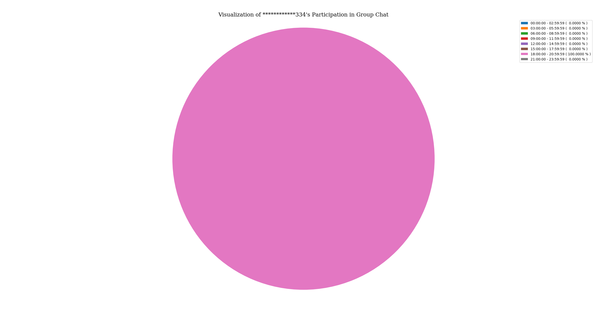

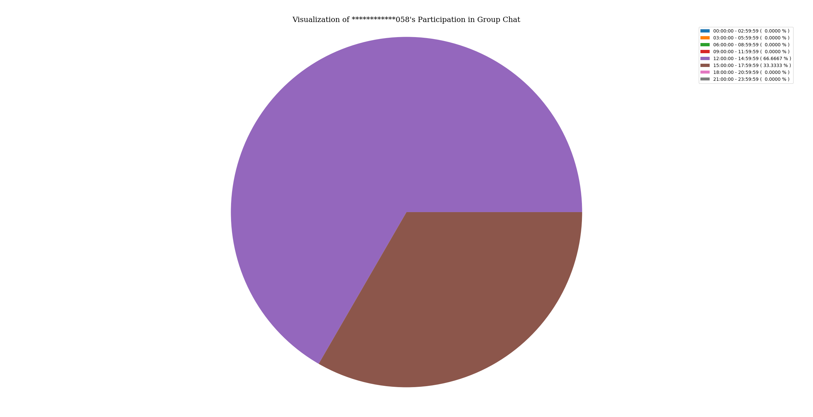

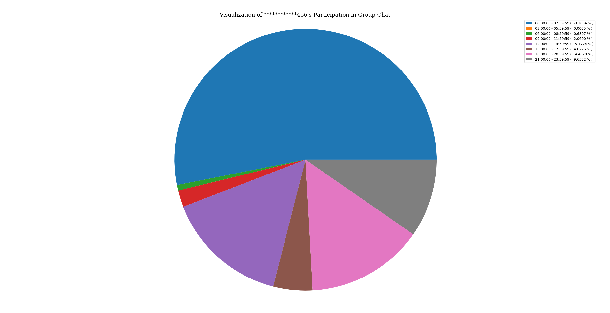

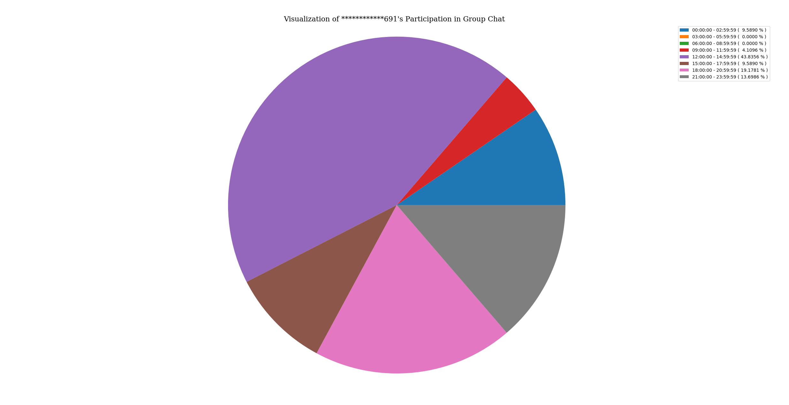
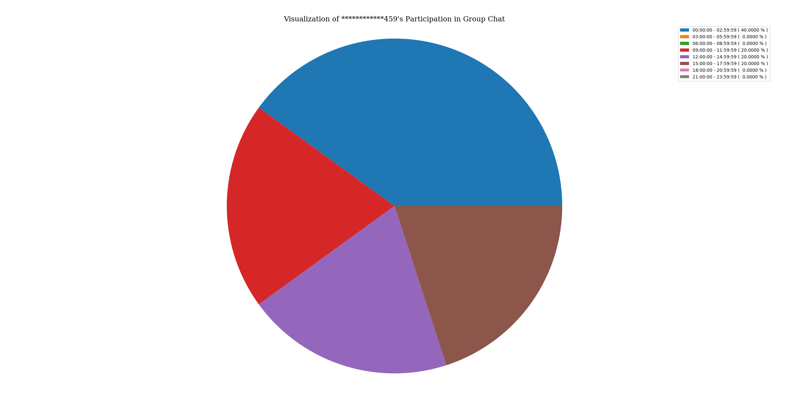

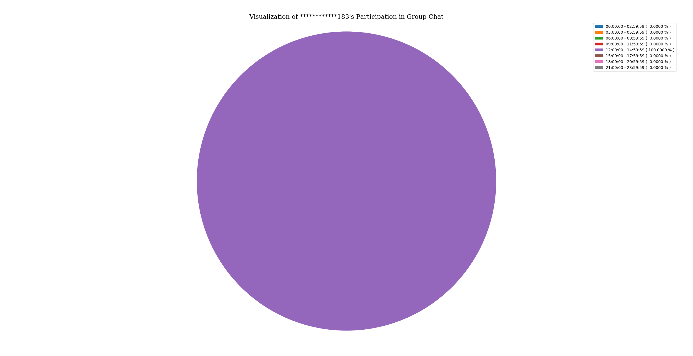
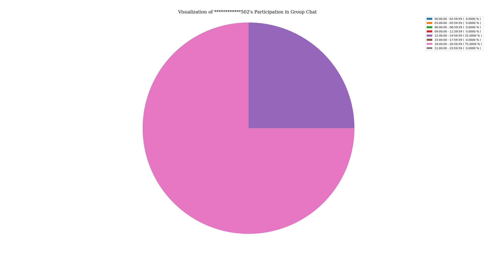

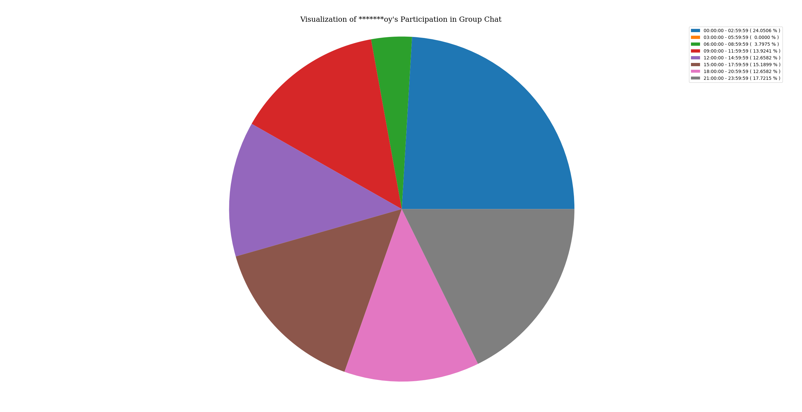
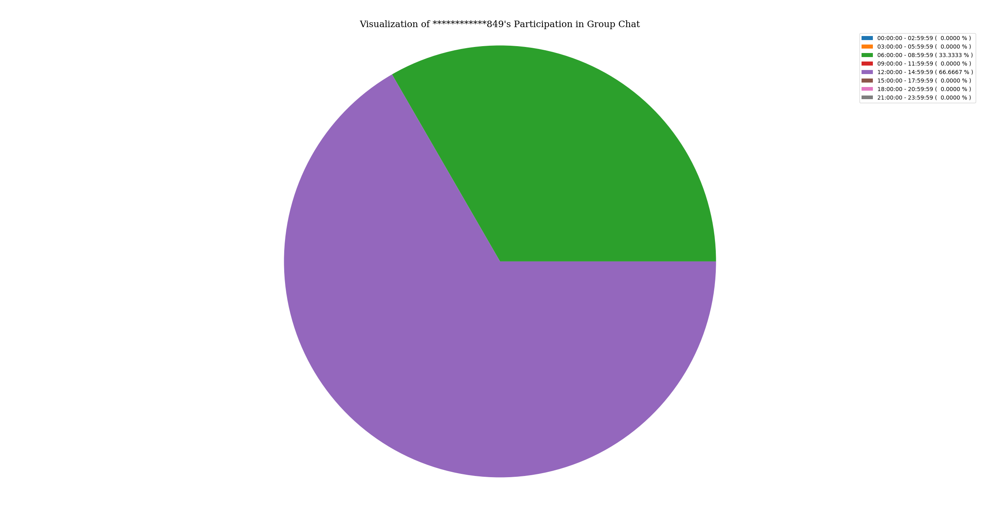

ByHour.png)
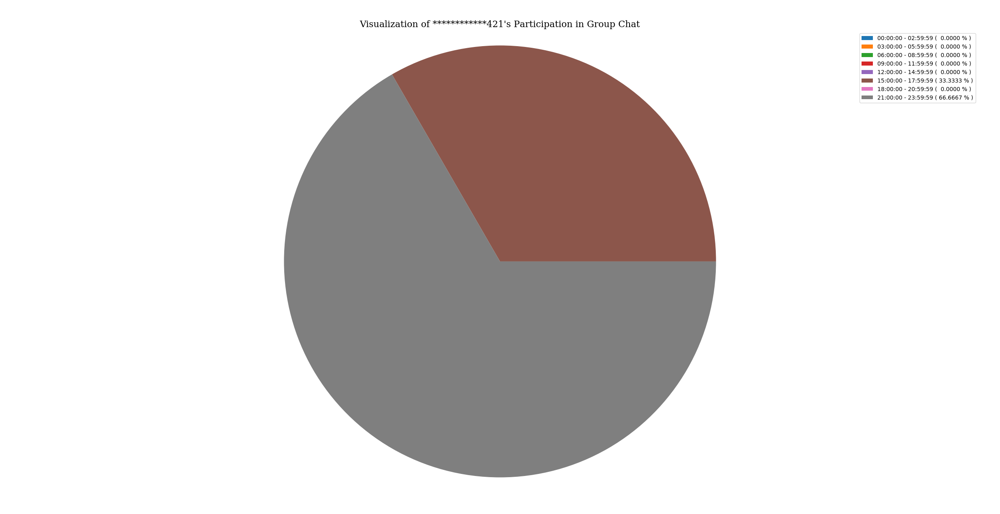

ByHour.png)

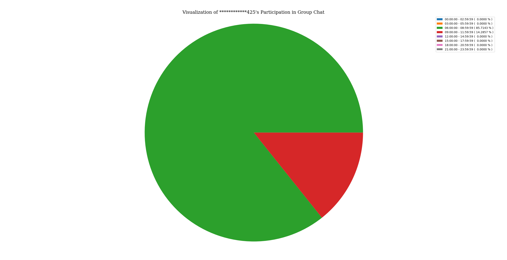

